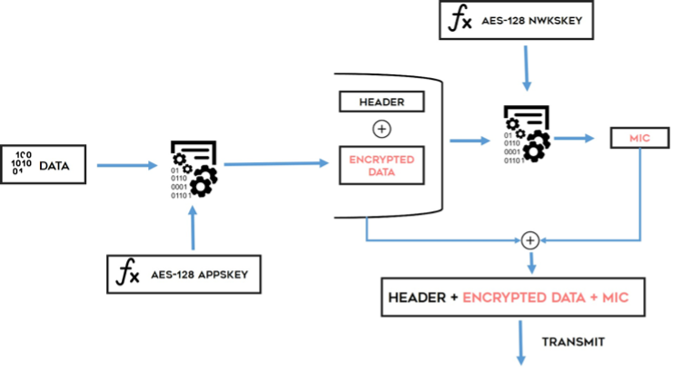
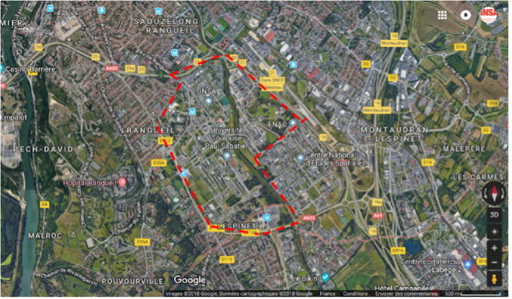
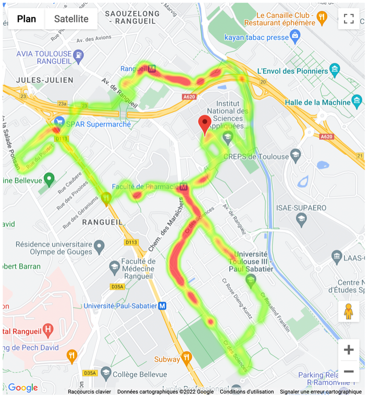
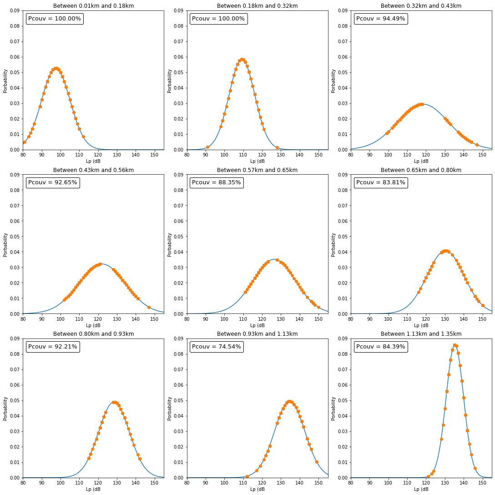
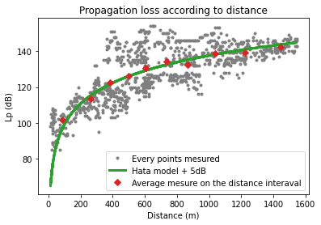

# **Dimensionnement d’interface radio pour réseaux mobiles**

* BACCONNIER Agathe
* FAVARY Pierre
* FONTANA Théo
* MARTHRIN-JOHN Lauric
* NIXARLIDIS Dimitrios

## **Introduction**
L’objectif de ce bureau d’étude est la réalisation d’un modèle de propagation, pour l’étude d’un système de stationnement qui est localisé sur le campus de Rangueil à Toulouse. Son principal objectif est de simplifier la recherche d’une place de parking pour les personnes qui se rendent dans ce quartier en voiture. Elle permet de savoir si une place est occupée ou non à l’aide de messages envoyés à une passerelle. Le système repose sur le protocole de communication LoRaWAN “Long Range radio Wide Area Network” qui s’appuie sur LoRa pour la couche physique. Cela permettra de connaître le taux d’occupation des places de stationnement dans la zone considérée.

Notre document a pour but de synthétiser l’étude que nous avons effectuée et d’évaluer les performances de cette solution. Premièrement, nous allons présenter l’interface radio LoRa. Ensuite, nous allons présenter le cas d’étude ainsi qu’une étude théorique par simulation liée à des mesures sur le terrain. Enfin, nous allons proposer un choix de dimensionnement pour avoir un fonctionnement optimal dans une zone

## **Présentation de l'interface radio LoRa**
Nous commencerons par vous présenter rapidement les différents éléments qui sont importants voir même les clés de l'interface radio LoRa, ceux qui nous semblent indispensables à savoir pour la compréhension du reste du rapport.

### **La Technologie LoRa**
La technologie LoRa est vue comme une technologie dite de LPWAN, l'acronyme de “Low Power Wide Area Network”. Cette catégorie de LPWAN a pour avantage de couvrir une zone pouvant aller jusqu’à plusieurs dizaines de kilomètres.
Elle doit pouvoir supporter les contraintes suivantes :
Base consommation au niveau énergétique
Liaison sécurisée entre les éléments du réseau
Localisation GPS possible des équipements
Développement avec un coût faible
Débit allant d’une dizaine de bits à quelques kilobits par seconde

### **Caractéristiques techniques**
En fonction de la localisation d’utilisation d’une zone géographique. Voici un tableau récapitulatif qui résume les contraintes en Europe :

||Europe|
|---|---|
|Frequency band|867-869MHz|
|Channel|10|
|Channel BW Up|125/250kHz|
|Channel BW Dn|125kHz|
|TX Power Up|+14dBm|
|TX Power Dn|+14dBm|
|SF Up|7-12|
|Data rate|250bps- 50kbps|
|Link Budget Up|155dB|
|Link Budget DN|155dB|

*Figure 1 : Spécification LoRaWAN en Europe*

La couche physique de LoRa dispose d’une modulation de type « Chirp Spread Spectrum » appelée CSS. Un chirp est un signal sinusoïdal qui augmente ou qui diminue linéairement en fréquence. On parle alors de « up-chirp » ou « down-chirp ». 

Pour coder l’information, la modulation est faite en fonction d’un offset fréquentiel des signaux montants du up-chirps. Pour avoir une variété de position d’offset fréquentiel, il est utilisé un paramètre appelé SF pour «Spreading Factor». Celui-ci est égal à 2 fois SF. Ainsi sa valeur fluctue entre  0 et 2*SF-1.
Ensuite, la modulation est obtenue grâce à d’autres paramètres qui sont réglables comme le Spreading Factor SF puis la bande passante du signal chirp noté BW et le Coding Rate noté CR. Ainsi, il possible de schématiser le fonctionnement d’un modulateur LoRa :

*Figure 2 : Schéma simplifié modulateur LoRa*

Il est possible de jouer avec ces paramètres pour modifier la modulation LoRa. Il est possible de changer le comportement du fonctionnement des objets sur le réseau LoRa. En fonction du besoin recherché, il est préférable de modifier certains paramètres. Et par conséquent, cela aura un impact sur d’autres aspects. Comme l’explique succinctement le tableau ci-dessous, En augmentant la bande passante BW, le débit binaire en sera augmenté. Cependant, la sensibilité et la consommation énergétique seront moins importantes.

|SF|BW (kHz)| CR=4/5 (bits/s)|CR=4/6 (bits/s)|CR=4/7 (bits/s)|CR=4/8 (bits/s)|
|---|---|---|---|---|---|
7|250|10938|9115|7812|6836
7|125|5469|4557|3906|3418
8|125|3125|2604|2232|1953
9|125|1758|1465|1256|1099
10|125|977|814|698|610
11|125|537|448|384|336
12|125|293|244|209|183|

*Figure 3 - Tableau des paramètres SF, BW et CR*

## **Cas d'étude**
Ce bureau d’étude est réalisé dans l'optique de créer un système de stationnement dit intelligent, qui consiste à la transmettre de la disponibilité des places de parking à l’aide de capteur communicant par du LoRa. La zone d’étude se porte sur le campus de Rangueil. Le matériel est basé sur un émetteur/récepteur LoRa SX1272 couplé à un module GPS. Les mesures recueillies ont été prises dans les alentours du campus de l’INSA de Toulouse.

### **Le réseau LoRa étudié**
**Paramètres**

Dans ce cas d'étude, la passerelle Lora appelée aussi l’émetteur ou bien la gateway se situe au sommet du bâtiment du GEI et nous sert de point de référence pour notre analyse et notre conception.

* Adresse du bâtiment GEI de l’INSA : 135 Avenue de Rangueil 31400 Toulouse 
* Hauteur de la passerelle : 18 mètres 
* Gain de l’antenne : 0 dB
* Puissance d’émission : 14 dBm 
* Pertes : 4.1 dBi
* Préambule : 12 symboles
* Fréquence centrale : 868.1 MHz 
* BW = 125 kHz, SF = 12, CR = ⅘, 
* Header : mode explicite.

La zone dite de service de 2.92km² comporte plus de 4000 places de parking et que le taux de rotation est estimé à 4 véhicules par place et par jour, un simple calcul permet de nous rendre compte que pour une journée le nombre de messages est égale à 4 rotations * 2 A/R * 4000 = 32 000. Une journée de 24 heures dispose de 86 400 secondes, en conséquence un message sera émis toutes les 2,7 secondes en moyenne. Grâce à un logiciel proposé par Semtech, LoRa modem Calculator Tool, on peut connaître théoriquement le temps que mettra un message pour être transmis: le  TOA, ou « Time On Air », qui est de 1122,3 ms avec les paramètres plus haut.

**Étude des chances de collision**

Pour éviter les collisions, le début d’émission de deux messages doit être espacé d’au moins 2*TOA, soit  2244,6 ms. Une application de la loi de Poisson nous donne une probabilité de collision de 56,45% pour tout message émis. On considère une collision comme un nombre strictement positif de messages émis sur une période de 2*TOA suivant l’émission du premier; cela donne 18 000 messages en collision par jour avec ces paramètres.

Le cahier des charges demande une probabilité de collision maximale de 10%. Comme il nous est impossible de jouer sur le nombre de messages échangés, nous devons jouer obligatoirement sur le TOA : il devra descendre à 142 ms ou moins pour atteindre les objectifs.

Pour cela utiliser un spreading factor inférieur à 9 suffit, cependant les stations les plus éloignées n’auraient pas une réception correcte.
En utilisant les trois bandes de fréquence fournies, un minimum de trois spreading factors sur les sept proposés permet également de descendre sous les 10% (sans collisions entre les messages de spreading factor différent comme les émissions seront orthogonales), ce même en considérant le TOA associé au pire spreading factor (à savoir 1122,3ms pour 12) mais obligera à penser la répartition des spreading factors sur les capteurs.

En termes de mise à l’échelle, nous aurons encore des spreading factors disponibles si besoin mais qui nécessiteront de repenser encore leur répartition et ne permettront pas forcément d’étendre beaucoup la zone, faute de portée.

### **Présentation du module radio LoRa**
Le module radio LoRa est nommé ici SX1272. Il réalise l’émission et la réception proposée par la société SEMTECH. Cette technologie a été initialement inventée par Cycléo qui a été acquise par SEMTECH en 2012. 

Ce sont des modules qui sont généralement utilisés en domotique. Cependant, ils sont de plus en plus utilisés dans le domaine des systèmes de surveillance. Leur succès est dû en grande partie par son faible coût et sa facilité d’utilisation et de programmation.

Le module SX1272 est implanté dans un module LoRa Libelium qui est lui-même monté sur une carte Arduino Uno-Mega.

### **Présentation du matériel de mesure sur terrain**
Les mesures sur le terrain ont été effectuées grâce au module LoRa décrit précédemment avec un module GPS ajouté pour connaître la position précise du point de mesure. Le module a été relié à un ordinateur portable via un lien série pour une prise de mesure autonome en énergie.

Voici la zone dans laquelle les places de parking doivent être surveillées : 

*Figure 4 - Zone de service à couvrir en rouge*

## **Résultats des mesures sur terrain**
Nous avons réalisé les mesures grâce au matériel fourni. Périodiquement, notre script Arduino nous a fourni une position GPS (latitude et longitude) ainsi que la puissance du signal en dBm (RSSI, RSSI packet et SNR). Nous avons également relevé l’identifiant de la station émettrice afin d’être certains de mesurer les bonnes émissions. Nous n’avons cependant jamais capté de signal d’une autre station émettrice que la nôtre. Les relevés de nos [données](https://github.com/TheoFontana/LoRa_Dimensionnement/blob/main/src/data.csv) ainsi que le [code source des traitements réalisés](https://github.com/TheoFontana/LoRa_Dimensionnement/blob/main/src/dataAnalysis.ipynb) sont disponibles sur notre dépôt git dont le lien est en annexe avec des extraits de code choisis.

### **Présentation des résultats de mesure**
En affichant le RSSI_packet des paquets reçus sur la carte nous obtenons la couverture suivante :

Figure 5 - Zone couverte sur fond de carte Google MAP 
(Les zones rouges indiquent des niveaux très faibles)

Nous remarquons que certaines zones lointaines ont une meilleure qualité de réception que certaines zones plus proches. Ceci s’explique par le fait que la densité de bâtiments n’est pas la même partout, certains immeubles gênaient grandement la qualité de réception même lorsque nous étions relativement proche de la station de base.

Pour étudier de façon plus précise nos données nous décidons de les séparer en sous-ensembles ayant des distances proches. Pour cela nous trions nos points par rapport à la distance à l’antenne, puis nous les groupons par groupe de 100. Avec près de 1000 points nous nous retrouvons donc avec 10 groupes.

Sur chacun de ces groupes, nous calculons la moyenne de l’écart type en perte de propagations, nous supposons ensuite une distribution normale pour pouvoir calculer la probabilité que la perte de propagation soit inférieure au seuil de saturation de 145dB dans notre cas.

Nous obtenons les résultats suivants :

Figure 6 - Jeu de données normalisées par groupes en fonction de leur distance à l’antenne.

Nous observons que lorsque nous sommes proche de l’antenne la réception est toujours très bonne. En revanche, entre 300 et 400 mètres la réception commence à se dégrader.  Nous observons une forte augmentions de l’écart type dans nos valeurs, en effet à partir de cette distance nous pouvons nous trouver derrière un bâtiment ou bien être en visibilité directe avec la station de base.

A partir de 650m le taux de couverture passe sous les 90%, notre système permet donc d’assuré une bonne couverture dans un rayon de 650m.

Certaines séries de valeur voient leur taux de couverture augmenté même après ces distances, elles ne sont cependant pas à prendre un compte, le récepteur saturé.

## Extraction du modèle de propagation empirique 
Afin de déduire un modèle de propagation de nos données, nous nous basons sur les sous ensemble de données décrit dans la partie précédente. Pour chaque intervalle, nous calculons la distance moyenne et la perte de propagation moyenne.
Nous pouvons alors superposer ces points moyens sur nos données pour avoir une meilleure idée de la répartition des pertes de propagation. 
Nous obtenons le résultat suivant :

Figure 7 - Pertes de propagation en fonction de la distance 

Nous décidons de superposer à nos données le modèle de pertes de propagation Okumura–Hata dont nous rappelons les équations en zone urbaine moyennement dense :

$L_U=69.55 + 26.16\cdot log_{10}(f)-13.82\cdot log_{10}(h_B)-C_H+(44.9-6.55\cdot log_{10}(h_B))\cdot log_{10}(d)$

$C_H=0.8+(1.1\cdot log_{10}(f)-0.7)\cdot h_M-1.56log_{10}(f)$

$h_B$ : hauteur de l’antenne de la station de base

$h_M$ : hauteur de l’antenne de mesure

En ajoutant 7dB à ce modèle de propagation nous observons une très grande proximité avec nos point moyens. Ce qui semble confirmé que le modèle Okumura–Hata est pertinent dans notre environnement.

## Choix de dimensionnement du futur réseau LoRa
D’après nos résultats, il semble que la zone du campus de Rangueil soit correctement couverte et dispose d’une bonne réception du signal de la gateway. Malgré cela, certains grands bâtiments vers le nord et au sud de la zone qui affaiblissent énormément la communication et l’échange de message entre les capteurs et la gateway se font de manière convenable.

Concernant la portée radio du réseau dans sa configuration initiale et selon un calcul probabiliste. En regardant la figure 4, on se rend compte qu'à partir de 800 à 1000 mètres un grand nombre de points atteignent la limite à -137 dBm de l’émission de la gateway. 

Nos recommandations pour la future installation d'un réseau LoRa sur la zone de Rangueil sont de réaliser une évaluation du trafic sur la gateway actuellement en place, pour savoir si une deuxième gateway n'allège pas la charge de la première pour déterminer si c'est vraiment nécessaire. Néanmoins, si on augmente le nombre de gateway, on réduit aussi le rayon de couverture maximum. Avec l’ajout de gateway, on pourra utiliser une fréquence différente de celle utilisée par la première gateway ce qui permettrait d’éviter les interférences. Nous conseillons l’utilisation des trois bandes de fréquences acceptées et d’autant de spreading factors -de préférence les plus élevés, en les répartissant intelligemment de sorte à ceux que les plus faibles soient utilisés par les capteurs ayant la meilleure ligne de vue à la station centrale

## **Conclusion**

En conclusion, nous avons pu répondre à la problématique de stationnement intelligent, nous avons mis en place un système de mesures et d’analyse statique pour établir un modèle de propagation et dimensionner un réseau LoRa et avons pû répondre aux problématiques de collision et d’atténuation des signaux. Le modèle possède de nombreuses limites à cause des limites du capteur utilisé. Il permet cependant de donner un aperçu suffisant de manière à dimensionner le réseau.

Ce bureau d’étude a permis de nous mettre en condition réelle sur le terrain et ainsi nous avons pu observer et constater les difficultés qu’il doit y avoir dans le monde industriel, lorsqu’il y a des sites survey à réaliser pour mettre en place de nouvelles infrastructures de communications.
